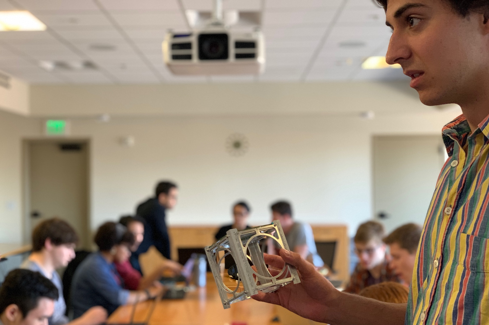

# Sapling — an open source 1U CubeSat

Sapling is an open source 1U CubeSat bus.

# Repositories

[systems](https://github.com/stanford-ssi/sapling-systems)

[pycubed-hardware](https://github.com/stanford-ssi/pycubed-hardware)

[sapling-software](https://github.com/stanford-ssi/sapling-software)

## Mission Status

| Mission | Launch Date | Status | Changes | 
| - | - | - | - |
| Sapling Semepervirens | 1.3.2023 | Failed to deploy | 
| Sapling Giganteum | April 2023 | Flight model undergoing testing | Magnetorquers, new structure, new solar charger | 
| Sapling Magnifica | Awaiting manifest | | |

   
  <b> <a href="https://github.com/jbaileyiii">@jbaileyiii</a> holds a structural model. PC: <a href="https://github.com/polygnomial">@polygnomial</a> </b> 
    

