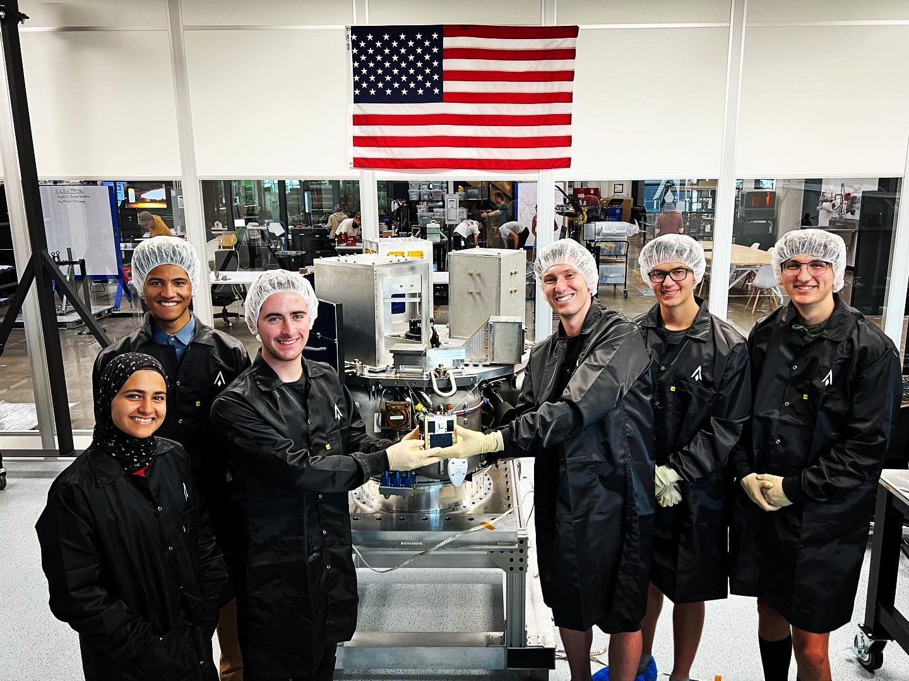
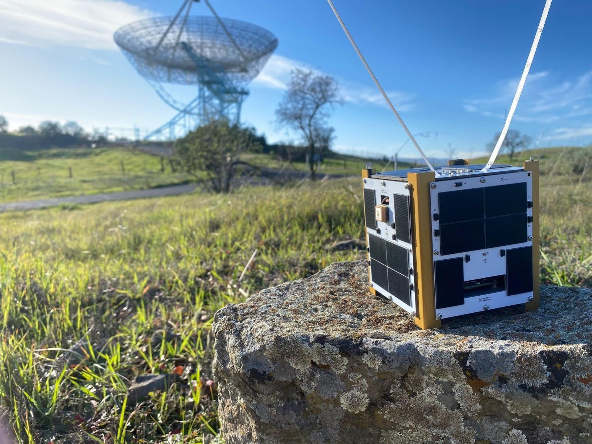

# Sapling — an open source 1U CubeSat bus

Check out our [wiki on notion](https://saplingsat.org)!

## Repositories

[systems](https://github.com/stanford-ssi/sapling-systems) - mission/vehicle design

[pycubed-hardware](https://github.com/stanford-ssi/pycubed-hardware)

[sapling-software](https://github.com/stanford-ssi/sapling-software) - flight, groundstation, and test software

[sapling-test](https://github.com/stanford-ssi/sapling-test) - test data and reports

## Mission Statuses

| Mission | Launch Date | Status | Changes | Key Lessons Learned |
| - | - | - | - | - |
| Sapling Sempervirens | 1.3.2023 | Successfully [launched](https://web.archive.org/web/20230217072805/https://news.satnews.com/2023/01/03/stanfords-sapling-sempervirens-smallsat-to-launch-on-the-spacex-transporter-6-mission/) on Transporter 6, and [failed to deploy](https://web.archive.org/web/20230217020855/https://www.launcherspace.com/updates/orbiter-sn1-mission-update) from the Launcher SN-1 orbital transfer vehicle| |
| Sapling Giganteum | 4.14.2023 |Successfully launched on Transporter-7, deployed. [Live telemetry here!](https://tinygs.com/satellite/Sapling2). | Addition of magnetorquers, new sheet metal structure, new solar charger. | |
| Sapling Magnifica | NET Fall 2023 | Preliminary design | New magnetometer and 6-Axis IMU | |

   
  <b> Sapling Sempervirens engineering model in the Launcher cleanroom </b> 
    

   
  <b> Sapling Sempervirens engineering model during range testing </b> 
    

